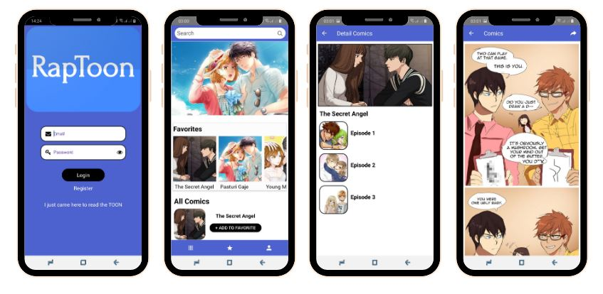
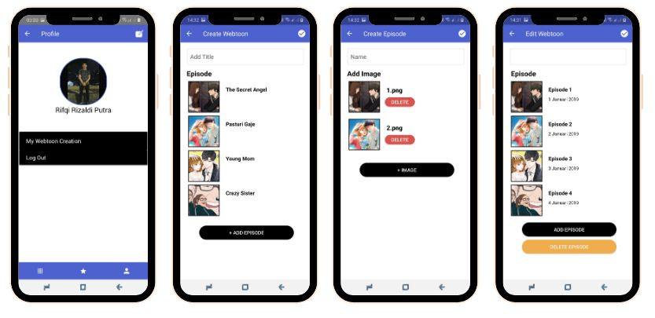

<h1 align="center">
   
</h1>

## Important
This project is still on very early development stage. If you want to use for production, use it with your own risk.
 More feature Coming Really Soon.

## Snohoy
RapToon is a comic reading app that is themed with modern comics that can fill your free time. This app is
inspired from the Webtoon app.

## Screenshots

  
  

## Features
* Manage rooms data
* Manage customers data
* Manage Orders activity

## Why Snohoy?
* Simple Usage
* It's React Native, so it support android & iOS by default!
* Simple Code, so you can easily contribute on it.

## Tech Stack
* React Native for the Mobile Frontend
* Express.Js as the Backend

## Contact 
* WA: 082177198865
* email: rifqirizaldiputra@gmail.com
* LinkedIn: bit.ly/linkedin-rifqirizaldi
